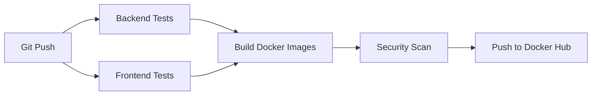

# CI/CD Pipeline - DevOps Tutor AI

[](https://github.com/YOUR_USERNAME/my-devops-bot/actions/workflows/ci.yml)

## Overview

Ce projet utilise **GitHub Actions** pour l'intégration continue et le déploiement continu (CI/CD).

## Pipeline Architecture



## Workflows

### 🔄 CI Pipeline (`.github/workflows/ci.yml`)

**Déclenchement :**
- Push sur `main` ou `develop`
- Pull requests vers `main`
- Manuel via GitHub UI

**Jobs :**

1. **Backend Tests**
   - Node.js 22
   - ESLint (sans auto-fix)
   - Jest avec coverage
   - Upload vers Codecov (optionnel)

2. **Frontend Tests**
   - Node.js 22
   - ESLint Vue.js
   - Vitest avec coverage
   - Upload vers Codecov (optionnel)

3. **Build Docker Images**
   - Multi-platform (amd64, arm64)
   - Cache Docker layers
   - Tags automatiques :
     - `latest` (branche main)
     - `develop` (branche develop)
     - `sha-<commit>` (tous)
     - `vX.Y.Z` (si tag Git)

4. **Security Scan**
   - Trivy vulnerability scanner
   - Rapports SARIF vers GitHub Security

## Configuration Requise

### GitHub Secrets

Dans **Settings > Secrets and variables > Actions**, ajoutez :

| Secret | Description | Exemple |
|--------|-------------|---------|
| `DOCKERHUB_USERNAME` | Nom d'utilisateur Docker Hub | `johnsmith` |
| `DOCKERHUB_TOKEN` | Token Docker Hub | `dckr_pat_xxx...` |
| `CODECOV_TOKEN` | Token Codecov (optionnel) | `xxx-xxx-xxx` |

### Docker Hub Token

1. Allez sur [hub.docker.com](https://hub.docker.com)
2. **Account Settings** > **Security** > **New Access Token**
3. Nom : `GitHub Actions`
4. Permissions : `Read, Write, Delete`
5. Copiez le token et ajoutez-le aux secrets GitHub

## Commandes Locales

### Backend (NestJS + Jest)

```bash
cd devops-tutor

# Tests
npm run test              # Mode watch
npm run test:ci           # CI mode avec coverage

# Linting
npm run lint              # Avec auto-fix
npm run lint:ci           # Sans auto-fix (CI)

# Build
npm run build
```

### Frontend (Vue.js + Vitest)

```bash
cd frontend-tutor

# Tests
npm run test              # Mode watch
npm run test:ci           # CI mode avec coverage

# Linting
npm run lint              # Lint check
npm run lint:ci           # Strict (max-warnings 0)

# Build
npm run build
```

## Stratégie de Branches

### `main` (Production)
- Déploiement automatique
- Tags `latest` et version semver
- Tests requis avant merge

### `develop` (Development)
- Pre-production
- Tag `develop`
- Tests automatiques

### Feature Branches
- Format : `feature/description`
- Pas de déploiement
- Tests obligatoires sur PR

## Images Docker

Les images sont publiées sur Docker Hub :

```bash
docker pull USERNAME/devops-tutor-api:latest
docker pull USERNAME/devops-tutor-web:latest
```

### Tags disponibles

- `latest` : Version stable (main)
- `develop` : Version dev
- `v1.0.0` : Releases spécifiques
- `main-sha-abc123` : Commits spécifiques

## Badges de Statut

Ajoutez ces badges à votre `README.md` :

```markdown
[](https://github.com/USERNAME/my-devops-bot/actions/workflows/ci.yml)
[](https://codecov.io/gh/USERNAME/my-devops-bot)
```

## Troubleshooting

### Tests échouent en CI mais pas localement

```bash
# Exécutez les tests en mode CI localement
cd devops-tutor && npm run test:ci
cd frontend-tutor && npm run test:ci
```

### Images Docker ne se construisent pas

```bash
# Testez le build localement
docker-compose build
```

### Secrets non définis

Vérifiez dans **Settings > Secrets and variables > Actions** que tous les secrets sont configurés.

## Prochaines Étapes

- [ ] Ajouter des tests E2E avec Playwright
- [ ] Configurer le déploiement automatique
- [ ] Ajouter des notifications Slack/Discord
- [ ] Mettre en place des environnements de staging

---

**Documentation mise à jour :** 24/01/2026
