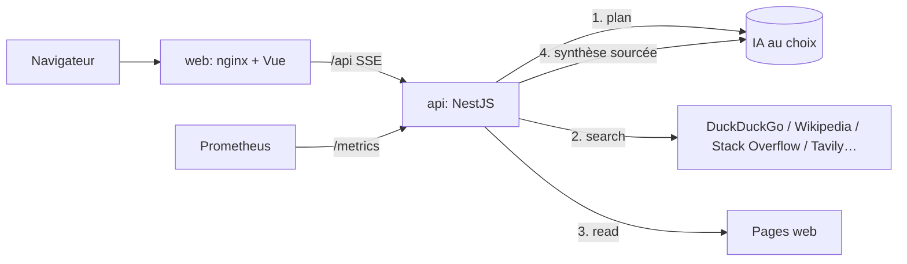

# DevOps Mentor 🤖

[](https://github.com/YOUR_USERNAME/my-devops-bot/actions/workflows/ci.yml)

Un mentor DevOps senior qui **recherche**, **vérifie** et **cite ses sources** avant de répondre.
Chaque réponse s'appuie sur des pages réellement lues (documentation officielle en priorité) et chaque fait précis est relié à sa source `[n]`.

> 📘 **Première installation ?** Suis le [guide de mise en route](docs/GUIDE.md) : clé IA, lancement, installation sur téléphone, dépannage.
> 🚀 **Mise en production ?** Voir le [guide CI/CD et déploiement VPS](docs/DEPLOY.md).

## ✨ Fonctionnalités

- **Pipeline de recherche visible en direct** : Analyse → Recherche → Lecture → Synthèse, affiché comme un job CI.
- **Recherche gratuite multi-moteurs** : DuckDuckGo, Wikipedia et Stack Overflow sans clé ; Tavily, Brave et SearXNG en option.
- **Anti-hallucination** : documentation officielle classée en premier, citations cliquables, aucun flag ni version inventés, et un avertissement explicite quand les sources manquent.
- **N'importe quelle IA** : Gemini, OpenAI, Claude, Mistral, Groq, OpenRouter, DeepSeek, xAI, Perplexity, Ollama ou toute API compatible OpenAI. La clé est détectée automatiquement.
- **Pédagogie** : réponse structurée (En bref, Comprendre, En pratique, Pièges, Pour aller plus loin), code commenté, diagrammes Mermaid.
- **Interface « console DevOps »** : animations anime.js, thèmes sombre et clair, historique local, streaming, copie de code.
- **PWA installable et responsive** : ordinateur, Android et iPhone, mode hors ligne, mises à jour proposées, panneaux natifs sur mobile.
- **Prêt pour la prod** : sondes `/health`, métriques Prometheus, image non-root, protection SSRF, rendu HTML assaini.

## 🏗️ Architecture



| Module | Rôle |
|---|---|
| `devops-tutor/src/llm` | Catalogue des fournisseurs, détection de clé, client streaming unique (protocoles OpenAI, Gemini, Anthropic) |
| `devops-tutor/src/research` | Moteurs de recherche, classement par fiabilité, extraction du texte utile des pages |
| `devops-tutor/src/tutor` | Pipeline, prompts (persona et règles de vérité), API SSE |
| `frontend-tutor/src` | Interface Vue 3 : pipeline, sources, rendu Markdown sécurisé, paramètres |

## ⚙️ Configuration (backend)

Toutes les variables sont **optionnelles**. Sans clé côté serveur, chaque utilisateur branche la sienne dans ⚙ Paramètres.

| Variable | Description |
|---|---|
| `GEMINI_API_KEY` | Clé Google AI Studio (prioritaire si plusieurs clés sont présentes) |
| `OPENAI_API_KEY`, `ANTHROPIC_API_KEY`, `MISTRAL_API_KEY`, `GROQ_API_KEY`, `OPENROUTER_API_KEY`, `DEEPSEEK_API_KEY`, `XAI_API_KEY`, `PERPLEXITY_API_KEY` | Autres fournisseurs |
| `LLM_API_KEY` / `LLM_PROVIDER` / `LLM_MODEL` / `LLM_BASE_URL` | Configuration générique : force un fournisseur, un modèle ou une URL |
| `TAVILY_API_KEY` | Recherche Tavily (1 000 requêtes/mois gratuites) |
| `BRAVE_API_KEY` | Brave Search API (offre gratuite) |
| `SEARXNG_URL` | Instance SearXNG auto-hébergée (format JSON activé) |
| `STACKEXCHANGE_KEY` | Augmente le quota de l'API Stack Exchange |
| `ALLOW_CUSTOM_BASE_URL` | `true` pour autoriser Ollama ou une URL compatible OpenAI saisie dans l'interface |
| `HTTPS_PROXY` / `NO_PROXY` | Proxy d'entreprise (utilisé seulement s'il est défini) |

> Les fichiers `.env` utilisés par Kustomize ou Docker Compose s'écrivent **sans guillemets** : `GEMINI_API_KEY=AIza…`

## 🚀 Lancer

### Docker Compose
```bash
echo "GEMINI_API_KEY=AIza..." > .env
docker compose up --build
# http://localhost:8280
```

### Kubernetes local (kind)
Les manifests Kustomize (`kustomization.yaml`) génèrent le secret à partir de `.env`, plus des sondes et des limites de ressources.
```bash
docker build -t madiyanke/devops-tutor-api:local devops-tutor
docker build -t madiyanke/devops-tutor-web:local frontend-tutor
kind load docker-image madiyanke/devops-tutor-api:local madiyanke/devops-tutor-web:local --name k8s101
kubectl apply -k <dossier-des-manifests>
kubectl rollout restart deploy -n dev
kubectl port-forward -n dev svc/web 8080:80
```

### Développement
```bash
cd devops-tutor && npm ci && npm run start:dev      # API sur :3000
cd frontend-tutor && npm ci && VITE_API_URL=http://localhost:3000 npm run dev
```

## 🔌 API

| Méthode | Route | Description |
|---|---|---|
| `POST` | `/tutor/ask/stream` | Réponse en Server-Sent Events : `meta`, `step`, `plan`, `sources`, `token`, `done`, `error` |
| `POST` | `/tutor/ask` | Même pipeline, réponse JSON complète |
| `GET` | `/tutor/config` | Fournisseurs, moteurs actifs, IA serveur (jamais les clés) |
| `POST` | `/tutor/llm/test` | Vérifie qu'une clé et un modèle fonctionnent |
| `POST` | `/tutor/llm/models` | Liste les modèles disponibles pour une clé |
| `GET` | `/health`, `/metrics` | Sondes Kubernetes et métriques Prometheus (`tutor_questions_total`, `tutor_answer_duration_seconds`) |

Corps de `/tutor/ask*` :
```json
{ "message": "…", "history": [{ "role": "user", "content": "…" }], "depth": "standard | deep",
  "llm": { "provider": "auto", "apiKey": "…", "model": "…" } }
```

## 🧪 Tests
```bash
cd devops-tutor && npm run lint:ci && npm test && npm run test:e2e
cd frontend-tutor && npm run lint:ci && npm run test:ci
```

## 🔐 Sécurité
- Les clés fournies par l'utilisateur restent dans son navigateur et ne sont jamais journalisées ni stockées côté serveur.
- Les pages lues sont filtrées : les adresses internes et privées sont refusées (protection SSRF).
- Le Markdown produit par l'IA est assaini (DOMPurify) avant affichage.
- Le contenu des sources est traité comme une donnée non fiable : les instructions qu'il contient sont ignorées par le prompt.
