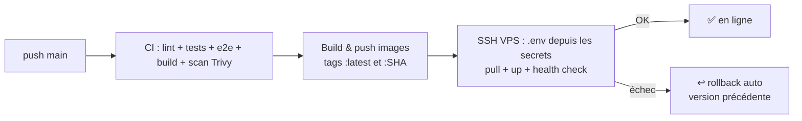

# Déploiement CI/CD sur le VPS

Chaque `push` sur `main` déclenche **automatiquement** le pipeline suivant :



- **CI** (`.github/workflows/ci.yml`) : s'exécute aussi seule sur les pull requests et les autres branches.
- **CD** (`.github/workflows/cd.yml`) : appelle la CI, publie les images, puis déploie avec `scripts/deploy.sh`.
- Les images sont taguées avec le **SHA du commit**. Le VPS sait donc toujours quelle version tourne, et revient à la précédente si la nouvelle ne démarre pas.
- **Aucun proxy** n'est utilisé.

---

## 1. Secrets et variables GitHub

Dans le dépôt : **Settings → Secrets and variables → Actions**.

### Secrets (onglet *Secrets*) — noms exacts attendus

| Nom | Obligatoire | Contenu |
|---|---|---|
| `DOCKERHUB_USERNAME` | ✅ | Ton identifiant Docker Hub (ex. `madiyanke`) |
| `DOCKERHUB_TOKEN` | ✅ | Jeton d'accès Docker Hub (*Account settings → Personal access tokens*, droits Read & Write) |
| `VPS_HOST` | ✅ | IP ou nom d'hôte du VPS |
| `VPS_USERNAME` | ✅ | Utilisateur SSH qui déploie (membre du groupe `docker`) |
| `VPS_SSH_KEY` | ✅ | Clé **privée** SSH complète, de `-----BEGIN` à `-----END` inclus |
| `VPS_DEPLOY_PATH` | ✅ | Dossier de déploiement, ex. `/opt/devops-tutor` |
| `SSH_PORT` | ➖ | Port SSH (22 par défaut) |
| `GEMINI_API_KEY` | ✅ | Clé Gemini (sans guillemets) |
| `TAVILY_API_KEY` | ➖ | Recherche Tavily (recommandée) |
| `BRAVE_API_KEY` | ➖ | Recherche Brave |
| `OPENAI_API_KEY` | ➖ | Seulement si tu veux OpenAI côté serveur |
| `GRAFANA_ADMIN_PASSWORD` | ➖ (recommandé) | Mot de passe admin Grafana (sinon `admin`) |

> ⚠️ Les noms doivent être **identiques** à ceux du tableau. Si tu as créé par exemple `GEMINI_KEY`, renomme-le en `GEMINI_API_KEY`.

### Variables (onglet *Variables*, non sensibles, toutes optionnelles)

| Nom | Défaut | Rôle |
|---|---|---|
| `APP_URL` | — | URL publique (ex. `https://tdevops.hamidnd.me`) : active le test de fumée final et le lien dans l'onglet *Environments* |
| `WEB_PORT` | `8099` | Port de l'application sur le VPS |
| `WEB_BIND` | `0.0.0.0` | Mettre `127.0.0.1` si ton reverse proxy tourne **directement sur l'hôte** (le port n'est alors plus exposé sur Internet) |
| `LLM_MODEL` | `gemini-2.5-flash` | Forcer un autre modèle |

---

## 2. Préparer le VPS (une seule fois)

Connecte-toi en SSH au VPS.

```bash
# Docker + plugin compose (si absent)
curl -fsSL https://get.docker.com | sh

# Utilisateur de déploiement autorisé à piloter Docker
sudo usermod -aG docker $USER        # puis se déconnecter / reconnecter

# Dossier de déploiement (= secret VPS_DEPLOY_PATH)
sudo mkdir -p /opt/devops-tutor && sudo chown $USER: /opt/devops-tutor

# Vérifications
docker compose version && curl --version | head -1
```

### Clé SSH dédiée au déploiement
Sur **ton PC** (PowerShell) :
```powershell
ssh-keygen -t ed25519 -C "github-actions-devops-tutor" -f $HOME\.ssh\devops_tutor_deploy -N '""'
type $HOME\.ssh\devops_tutor_deploy.pub
```
- Ajoute la ligne affichée (clé **publique**) à la fin de `~/.ssh/authorized_keys` sur le VPS.
- Copie le contenu de `devops_tutor_deploy` (clé **privée**) dans le secret `VPS_SSH_KEY`.
- Teste : `ssh -i $HOME\.ssh\devops_tutor_deploy UTILISATEUR@VPS "docker ps"`

### Retirer l'ancien runner self-hosted
L'ancien pipeline tournait sur un runner GitHub installé sur le VPS. Il n'est plus utilisé :
```bash
cd ~/actions-runner        # dossier d'installation du runner
sudo ./svc.sh stop && sudo ./svc.sh uninstall
```
Supprime-le aussi dans **Settings → Actions → Runners**.
Les anciens conteneurs (`devops-tutor-api`, `monitoring-grafana`…) sont remplacés automatiquement au premier déploiement.

---

## 3. HTTPS (indispensable pour la PWA)

Configuration utilisée : **Cloudflare** (DNS + certificat) devant **nginx** sur le VPS, qui redirige vers l'application sur `127.0.0.1:8190`.

1. **Variables GitHub** : `WEB_PORT=8190` et `WEB_BIND=127.0.0.1`.
2. **Cloudflare → DNS** : enregistrement `A` `tdevops` → IP du VPS, **proxy activé** (nuage orange).
3. **Cloudflare → SSL/TLS** : mode **Full (strict)**, avec le certificat d'origine Cloudflare déjà installé dans `/etc/nginx/ssl/`.
4. **nginx** : fichier `/etc/nginx/sites-available/tdevops.hamidnd.me` :

```nginx
# DevOps Mentor : tdevops.hamidnd.me → conteneur web (127.0.0.1:8190)
server {
    listen 80;
    listen [::]:80;
    server_name tdevops.hamidnd.me;
    return 301 https://$host$request_uri;
}

server {
    listen 443 ssl;
    listen [::]:443 ssl;
    http2 on;
    server_name tdevops.hamidnd.me;

    # Certificat d'origine Cloudflare (wildcard *.hamidnd.me)
    ssl_certificate     /etc/nginx/ssl/cert.pem;
    ssl_certificate_key /etc/nginx/ssl/key.pem;

    client_max_body_size 1m;

    location / {
        proxy_pass         http://127.0.0.1:8190;
        proxy_http_version 1.1;
        proxy_set_header   Host $host;
        proxy_set_header   Connection "";
        proxy_set_header   X-Real-IP $remote_addr;
        proxy_set_header   X-Forwarded-For $proxy_add_x_forwarded_for;
        proxy_set_header   X-Forwarded-Proto https;

        # Streaming des réponses (Server-Sent Events) : aucun tampon
        proxy_buffering    off;
        proxy_cache        off;

        # Recherche + génération : jusqu'à quelques minutes
        proxy_read_timeout 300s;
        proxy_send_timeout 300s;
    }
}
```

Activation :
```bash
sudo ln -s /etc/nginx/sites-available/tdevops.hamidnd.me /etc/nginx/sites-enabled/
sudo nginx -t && sudo systemctl reload nginx
```

> Cloudflare coupe une requête si l'origine ne répond rien pendant 100 s (erreur 524). L'API envoie ses en-têtes immédiatement, puis un signal toutes les 15 s pendant le streaming : la limite n'est donc pas atteinte.

---

## 4. Premier déploiement

1. Commit et push sur `main` (ou **Actions → Deploy to Production → Run workflow**).
2. Suis les 3 étapes dans l'onglet **Actions** : `ci` → `build-and-push` → `deploy`.
3. En fin de job, tu dois voir :
   ```
   ✅ devops-tutor-api : healthy
   ✅ devops-tutor-web : healthy
   ✅ Chaîne web → API opérationnelle
   🚀 Déploiement <sha> terminé.
   ```
4. Ouvre ton domaine et pose une question.

---

## 5. Exploitation

```bash
cd /opt/devops-tutor
docker compose -f docker-compose.prod.yml ps            # état
docker logs -f devops-tutor-api                          # logs de l'API
cat .deployed_tag                                         # version en ligne
```

**Revenir manuellement à une version** (n'importe quel SHA publié sur Docker Hub) :
```bash
bash scripts/deploy.sh <sha>
```

**Changer une clé** : modifie le secret GitHub, puis **Actions → Deploy to Production → Run workflow**. Le `.env` du VPS est régénéré à chaque déploiement, ne le modifie pas à la main.

**Grafana** (non exposé sur Internet) :
```powershell
ssh -L 3004:127.0.0.1:3004 UTILISATEUR@VPS
```
puis http://localhost:3004 (utilisateur `admin`, mot de passe = `GRAFANA_ADMIN_PASSWORD`). La source Prometheus est déjà configurée. Métriques utiles : `tutor_questions_total`, `tutor_answer_duration_seconds`.

---

## 6. Dépannage

| Symptôme | Cause | Solution |
|---|---|---|
| `build-and-push` : *unauthorized* | `DOCKERHUB_TOKEN` invalide ou en lecture seule | Recréer un jeton Read & Write |
| `deploy` : *ssh: handshake failed* / *unable to authenticate* | Clé privée incomplète, ou clé publique absente du VPS | Recopier toute la clé privée ; vérifier `authorized_keys` |
| `deploy` : *permission denied … docker.sock* | Utilisateur hors du groupe `docker` | `sudo usermod -aG docker <user>`, puis reconnexion |
| `deploy` : *cd: … No such file* | Dossier inexistant | `mkdir -p` + `chown` (étape 2) |
| *Le port … est déjà utilisé* / *port is already allocated* | Un autre service occupe ce port : le script s'arrête sans rien toucher | `sudo ss -ltnp 'sport = :<port>'` ; changer la variable `WEB_PORT` et le `proxy_pass` nginx |
| Erreur Cloudflare 521 / 502 | nginx ne joint pas l'application | `curl -I http://127.0.0.1:8190` sur le VPS ; vérifier `WEB_PORT` = port du `proxy_pass` |
| Erreur Cloudflare 526 | Certificat d'origine invalide en mode Full (strict) | Vérifier `/etc/nginx/ssl/cert.pem` et `key.pem` |
| `↩️ Version … restaurée` | La nouvelle version ne démarre pas : la production reste sur l'ancienne | Lire les « Logs API » affichés dans le job |
| L'app répond mais « Aucune IA configurée » | Secret `GEMINI_API_KEY` absent ou mal nommé | Vérifier le nom exact, puis relancer le workflow |
| Réponses qui arrivent d'un bloc, ou coupées | Buffering du reverse proxy | `proxy_buffering off` (nginx) ou `flush_interval -1` (Caddy) |
| Pas de bouton « Installer » sur mobile | Site en HTTP | Configurer HTTPS (étape 3) |
